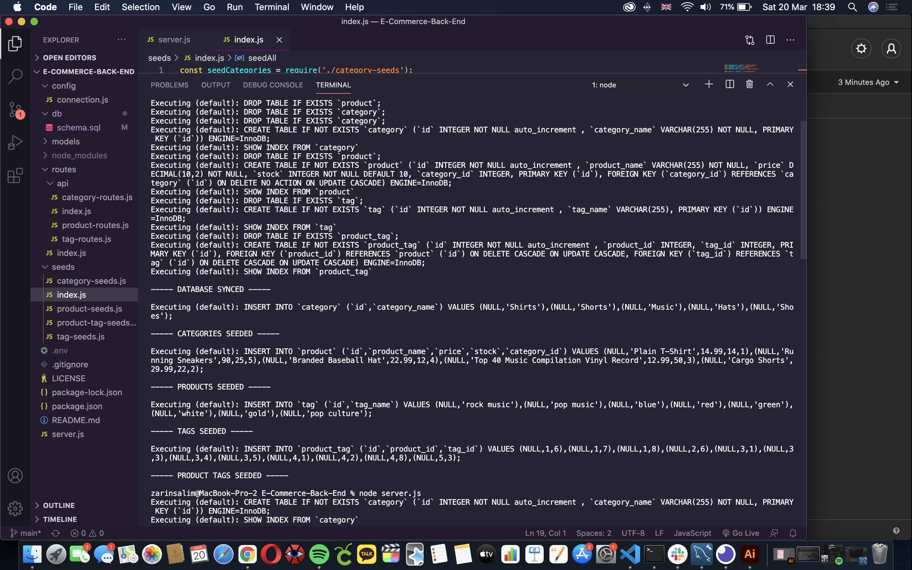

# E-Commerce Back End
Back end for an e-commerce site

## Pseudo Code
1. Install node packages - mysql, sequelize, dotenv, express
2. Create models
3. Create routes
4. Test out models and routes in Insomnia

Based on this my code would have to:
- Use database models
- Use association methods
- Use API routes to perform RESTful CRUD operations

## Difficulties
The main difficulty was in remembering ids and the association methods as it was quite confusing. It was also confusing as there were quite a lot of files to work with.

## Overall thoughts
I found this assignment fairly straightforward and I enjoyed creating the API and seeing how it all works together. 

## Video Demo
You can view a walkthrough of the application [here](https://drive.google.com/file/d/1zDP5NOc80eFpxXWffinc-UApx5U_GLle/view?usp=sharing)

